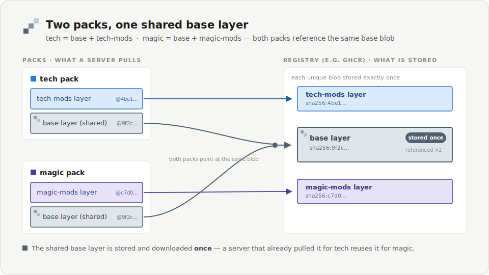
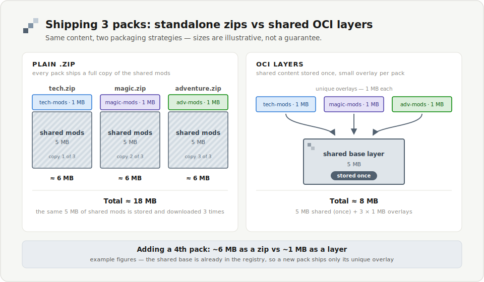
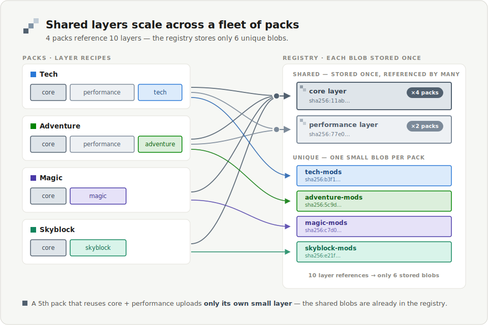

# OCI Modpack Template

Publish your Minecraft modpack as an **OCI artifact** so servers running
[itzg/docker-minecraft-server](https://github.com/itzg/docker-minecraft-server)
can install it with one line:

```
GENERIC_PACKS=oci://ghcr.io/you/your-repo/your-pack:latest
```

**You don't need to know what "OCI" means.** If you can put files into
folders on GitHub, you can publish a modpack with this template. GitHub
builds and hosts everything for you: no server, no command line, no cost.

What you get over a plain `.zip`:

- **Shared content is stored and downloaded once.** If five packs share the
  same base mods, that base is uploaded once and a server that already has
  it skips re-downloading. (This is the same trick Docker images use.)
- **Version pinning** built in: refer to a pack by a version tag or an
  exact `@sha256:...` fingerprint.
- **Private packs** work too, using a normal `docker login`.



---

## What's an OCI artifact? (60 seconds)

You don't need to understand this to use the template. The idea in plain
terms:

- A **container image** (the thing Docker uses) is a small description file
  plus a few compressed folders called **layers**, each identified by a
  unique fingerprint.
- A **registry** is the server that stores them, like Docker Hub or GitHub's
  own **GHCR**, which this template uses. A registry stores each layer only
  once, even when many things point at it.
- The format that registries and tools all agree on is the
  **[Open Container Initiative (OCI)](https://opencontainers.org/)**
  standard. Every modern registry speaks it.
- An **OCI artifact** is that same "description + layers" packaging used for
  something *other than* a runnable program. Helm charts, security
  signatures, and, here, **modpacks** all ride the same rails. A small
  label on the artifact says "this is a modpack, not an app," so tools don't
  try to run it.

So "publish your modpack as an OCI artifact" means: tar your pack into
a layer or two, write the little description file, and push it to a registry
your players' servers can already reach. Nothing new is invented; it's the
same plumbing behind every `docker pull`.

**Want the authoritative source?** The standard itself lives at
[opencontainers.org](https://opencontainers.org/); GitHub's registry that
this template publishes to is documented
[here](https://docs.github.com/en/packages/working-with-a-github-packages-registry/working-with-the-container-registry).

### Why not ship a `.zip`?

A plain `.zip` bundles every pack as one standalone blob, so shared content
is duplicated in each. With OCI layers, the shared part is stored once and a
new pack that reuses it costs only its own small layer:



---

## Before you start

- A free [GitHub account](https://github.com/signup).
- Your mod `.jar` files, and any config files you want to ship.

That's it.

---

## Step 1 - Make your own copy

Click the green **Use this template** button at the top of this page, then
**Create a new repository**. Give it a name (e.g. `my-modpacks`) and create
it. Everything below happens in *your* new copy.

> New GitHub repos have Actions enabled by default. If you ever see the
> Actions tab asking you to enable workflows, click the green enable button
> once.

---

## Step 2 - Learn the folders (30 seconds)

Your packs live under `packs/`. There is one simple rule:

```text
packs/
├── base/          <- OPTIONAL. Stuff shared by ALL your packs.
│   ├── mods/          Shared base is uploaded once and reused everywhere.
│   └── config/
├── tech/          <- One modpack. Published as .../tech
│   └── mods/
└── magic/         <- Another modpack. Published as .../magic
    └── mods/
```

- **`packs/base/`** is optional. Put anything common to every pack here.
- **Every other folder** in `packs/` becomes one published modpack, named
  after the folder.
- Inside a pack, use the same folder names a server expects: `mods/`,
  `config/`, `plugins/`, etc. Those land straight into the server's
  `/data`.

This repo ships with example `base`, `tech`, and `magic` packs so it works
the moment you create it. You'll replace them with your own in the next
step.

---

## Step 3 - Add your mods

1. Delete the `EXAMPLE-*.txt` placeholder files (they're only there so the
   template publishes something on day one).
2. Rename the pack folders, or add new ones, to match your packs. The
   folder name becomes the pack name.
3. Put your files in:
   - `packs/base/mods/` and `packs/base/config/`: shared by every pack.
   - `packs/<yourpack>/mods/`: that pack's own mods.

All in the browser: open a folder, click **Add file -> Upload files**, and
drag your `.jar`s in. (Or use GitHub Desktop / git if you prefer.)

> No shared content? Just delete `packs/base/` and give each pack its own
> full set of files.

> Prefer to track mods declaratively (by Modrinth/CurseForge project and
> version) instead of committing jars? See
> [docs/packwiz.md](docs/packwiz.md), where CI resolves the jars with
> packwiz and bakes them into the artifact. Note the redistribution warning
> there before publishing a baked pack publicly.

---

## Step 4 - Publish

**Just save your changes** (commit). That's the whole publish step.

Go to the **Actions** tab and watch the **publish** workflow run. When it
turns green, your packs are live. It publishes:

- the `:latest` tag every time you push to `main`, and
- a version tag (e.g. `v1.0.0`) whenever you create a
  [release/tag](https://docs.github.com/en/repositories/releasing-projects-on-github/managing-releases-in-a-repository)
  by that name, recommended so players can pin a version.

The workflow log ends with the exact addresses of your packs, e.g.
`ghcr.io/you/my-modpacks/tech:latest`.

---

## Step 5 - Make your packs downloadable (one-time)

New packages on GitHub start **private**. To let a server pull them without
a password:

1. Go to your GitHub profile -> **Packages**.
2. Open each pack -> **Package settings** -> **Change visibility** ->
   **Public**.

(Prefer to keep them private? Skip this and see
[Private packs](#private-packs) below.)

---

## Step 6 - Test it, step by step

### Quick test - one click, no server

1. Go to the **Actions** tab.
2. Pick the **test** workflow on the left.
3. Press **Run workflow**.

It pulls your packs back from the registry and prints:

- each pack's layers, where you'll see the **shared base layer's fingerprint
  is identical across packs**, proving it's stored once, and
- the **list of files each pack would drop into a server**, so you can
  confirm your mods are all there.

Green check = your packs are valid, public (or reachable), and correct.

### Real test - in an actual server

Use [`examples/server/docker-compose.yml`](examples/server/docker-compose.yml):
put your own pack addresses in it and run `docker compose up`. Your mods
appear in the server's `/data`. (Requires an `itzg/minecraft-server`
version that supports `oci://` generic packs.)

---

## Step 7 - Use it in your server

Set one environment variable on your `itzg/minecraft-server`:

```yaml
GENERIC_PACKS: "oci://ghcr.io/you/my-modpacks/tech:latest"
```

More than one pack, applied in order (later packs win on conflicts):

```yaml
GENERIC_PACKS: "oci://ghcr.io/you/my-modpacks/base-extras:latest,oci://ghcr.io/you/my-modpacks/tech:latest"
```

To avoid repeating the registry base on every entry, set
`GENERIC_PACKS_PREFIX`; each comma-separated entry is prefixed with it, so
every pack still carries its own tag:

```yaml
GENERIC_PACKS_PREFIX: "oci://ghcr.io/you/my-modpacks/"
GENERIC_PACKS: "base-extras:latest,tech:v1.2.0"
```

You can mix `oci://` refs with the plain URLs and file paths
`GENERIC_PACKS` already accepts. Pin a version with a tag
(`.../tech:v1.0.0`) or an exact digest (`.../tech@sha256:...`).

---

## The payoff, once you have many packs

The more packs you ship that share components, the more the shared layers
are reused: stored once in the registry and downloaded once per server,
no matter how many packs reference them:



---

## Private packs

If you keep your packages private, give the server credentials the same way
you would for a private Docker image:

- Run `docker login ghcr.io` on the server host, **or**
- Mount a registry auth file and point the server at it with
  `GENERIC_PACKS_OCI_AUTH_FILE=/path/to/config.json`.

See the itzg
[generic packs docs](https://docker-minecraft-server.readthedocs.io/en/latest/mods-and-plugins/#generic-pack-files)
for details.

---

## Troubleshooting

**The publish workflow is red.**
Open the failed run in the Actions tab. The most common cause is the
`packs/` folder having no pack folders (only `base/`), or Actions not being
enabled; enable it once from the Actions tab.

**My server can't pull the pack ("unauthorized" / "not found").**
The package is probably still private; do [Step 5](#step-5---make-your-packs-downloadable-one-time),
or provide credentials as in [Private packs](#private-packs). Also check the
address is all lowercase.

**My mods didn't show up in the server.**
Make sure files are inside `mods/` (or `config/`, `plugins/`, ...) within
the pack folder, not loose at the pack's top level; the server applies the
pack contents straight into `/data`.

**The test workflow can't find a pack.**
Run **publish** successfully first, and make sure the pack folder names
under `packs/` match what you published.

---

## Running locally (optional, for the curious)

You never need this; GitHub does it all. But if you want to build on your
own machine, install [mise](https://mise.jdx.dev) and run:

```sh
mise install                 # gets oras + jq
mise run build               # build layers into out/ (no upload)
oras login ghcr.io -u you    # one-time, to publish
REGISTRY=ghcr.io/you/my-modpacks mise run publish
REGISTRY=ghcr.io/you/my-modpacks mise run verify
```

---

## How it works under the hood

Each pack folder is turned into a **reproducible `tar.gz`** (fixed file
order and timestamps), so identical content always produces an identical
fingerprint, which is what lets the shared base layer be stored once. The
layers are pushed with [`oras`](https://oras.land) as an OCI artifact whose
type is `application/vnd.itzg.minecraft.modpack.v1+json`, with each layer
typed `application/vnd.itzg.minecraft.modpack.layer.v1.tar+gzip`. The
server's `install-oci-pack` validates those types, pulls the layers, and
extracts them into `/data` in order, the same pipeline it already uses for
`.zip`/`.tgz` generic packs.

---

## Glossary

| Term | In plain words |
| --- | --- |
| **Registry** | A place that stores packages. This template uses **GHCR**, GitHub's built-in one, free and already tied to your account. |
| **OCI artifact** | The standard "box" format registries use. Docker images are OCI artifacts; so are these modpacks. |
| **Layer** | One `tar.gz` of files inside a pack. Shared layers are stored once. |
| **Tag** | A friendly version label, like `latest` or `v1.0.0`. |
| **Digest** | An exact fingerprint (`sha256:...`) that always points at the same bytes. |

---

Questions or ideas? Open an issue. This template exists to support
`oci://` generic packs in
[itzg/docker-minecraft-server](https://github.com/itzg/docker-minecraft-server).
